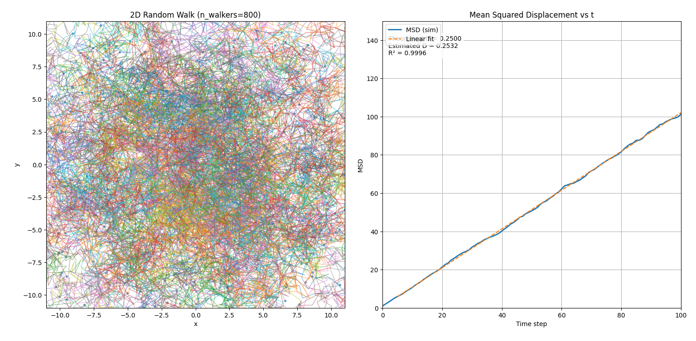
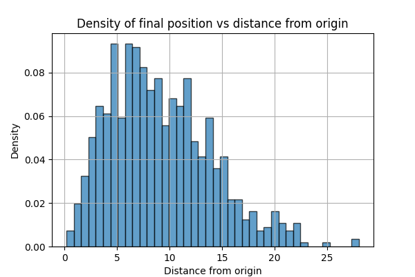

# 2D Random Walk Simulation

This project simulates a 2D random walk for multiple particles and visualizes their trajectories, mean squared displacement (MSD), and final position distributions.

## Features
- Simulates random walks for many particles in 2D.
- Animates the motion of all particles, showing their trails.
- Plots the mean squared displacement (MSD) and fits a line to estimate the diffusion coefficient.
- After the animation, displays:
  - Theoretical and estimated diffusion coefficients.
  - Density of final positions as a function of distance from the origin.

## Requirements
- Python 3.x
- numpy
- matplotlib

Install dependencies with:
```
pip install numpy matplotlib
```

## Usage
Run the simulation with:
```
python walk.py
```

You can adjust parameters at the top of `walk.py`:
- `n_walkers`: Number of particles
- `n_steps`: Number of time steps
- `step_size`: Step length
- `trail_length`: Number of previous positions to show for each trail

## Output
- Animated plot of all walkers and their trails (2D)
- MSD vs time with linear fit
- Density of final positions with respect to distance from the origin (radial density)

## Sample Output
Below are example output images generated by the simulation:

**Random Walk Animation Frame**



**Final Positions Density**



## License
MIT License
